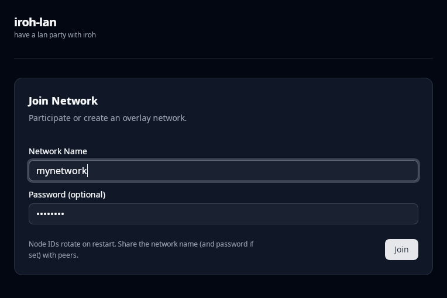
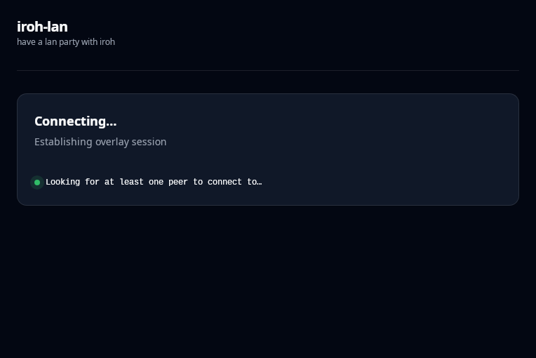
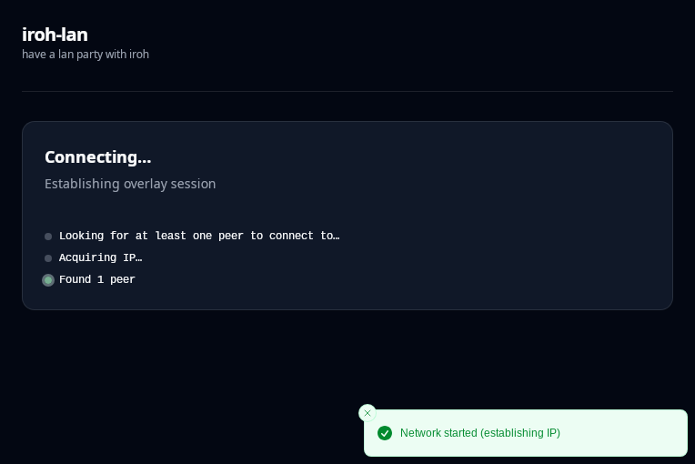
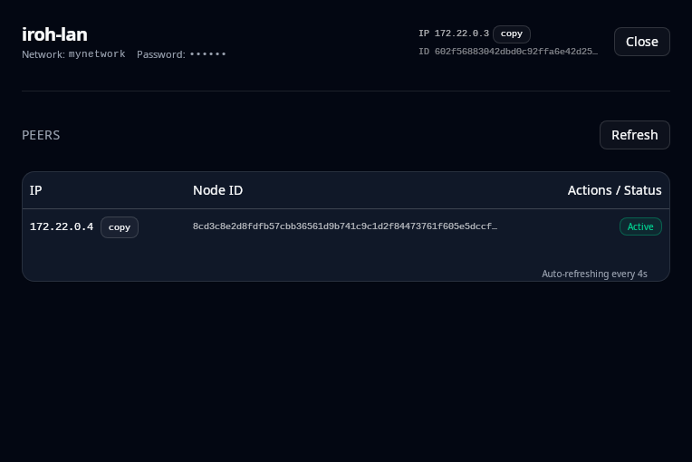
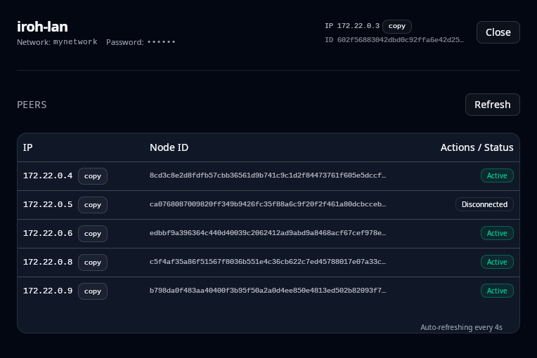

# iroh-lan

Have a lan party with iroh (iroh-lan = hamachi - account - install)

Just [download](https://github.com/rustonbsd/iroh-lan/releases) the released binaries or build it on Windows, MacOs and Linux and have your self a lan party.

# Video

[](https://www.youtube.com/watch?v=DNtDLPD3WrE)

## Download

Pre-built binaries are available from the [Releases page](https://github.com/rustonbsd/iroh-lan/releases). All builds are produced by GitHub Actions CI/CD.

**Windows**: Download `iroh-lan-ui-windows-x86_64.exe`  
**macOS**: Download `iroh-lan-ui-macos-arm64` (Apple Silicon) or `iroh-lan-ui-macos-x86_64` (Intel)  
**Linux**: Download `iroh-lan-ui-linux-x86_64`

On Linux and macOS, make the binary executable: `chmod +x iroh-lan-ui-*`

Requires admin/sudo rights to create the network interface. No accounts or dependencies required.

# UI

The iroh-lan UI is designed for zero-friction, ephemeral networking: no accounts, no central servers, no device lists. Name a network, choose a password, and you’re on a private L3 LAN with anyone who does the same, created out of thin air and gone when you leave.

1) Lobby - create or join a network



Enter any `Network name` and a shared `Password`, then click `Create / Join`.
- No signup or login.
- The network is purely peer‑to‑peer over iroh; it exists only while peers keep it alive.

2) Waiting for at least one peer



After creating the network, iroh announces it and looks for peers with the same name and password.
- If you’re first, you’ll see a waiting state until another peer appears.
- Discovery is distributed-no central service to depend on.

3) Acquiring an IP



With at least one peer present, the network assigns you a virtual IP from a private subnet. This can take a few seconds as peers converge.
- The UI shows progress while your L3 interface is set up.
- When ready, your machine can send UDP/TCP/ICMP within the virtual subnet.

4) Minimal network view



With one or a few peers, you’ll see your assigned IP and the network’s subnet. This is a fully‑functioning LAN overlay.
- Ping peers, SSH, host small game servers, or share services-just like the same Wi‑Fi.
- Everything is ephemeral: close the app and your presence (and the network if you’re the last peer) vanishes.

5) Network running



As more peers join, the UI lists them with their virtual IPs and status. Traffic flows directly over iroh using NAT traversal where possible.
- No relays, accounts or installation required of any kind.
- Keep the app open to stay reachable, quit to leave and nothing lingers.

I wanted a more convinient hamachi with less bugs:
- No accounts or central servers: join by name + password only.
- Pure P2P over iroh
- Ephemeral by default
- Works like a real LAN: UDP/TCP/ICMP at L3, so familiar tools should "just work."
- Simple cleanup: closing the UI tears everything down-no background services.

Tips
- Pick a memorable network name and share it with your teammates along with the password.
- First-time setup can take a few seconds while the network propagates and an IP is assigned.
- Leave the app running while you play/work, when you’re done, just quit to disappear from the network.


## Example

```rust
use iroh_lan::{RouterIp, network::Network};
use tokio::time::sleep;

#[tokio::main]
async fn main() -> anyhow::Result<()> {
    // elevate cross platform
    if !self_runas::is_elevated() {
        self_runas::admin()?;
        return Ok(());
    }
    
    // Create or join a self-bootstrapping L3 network.
    // Waits until at least one other peer is found.
    // All of this happens fully automatically.
    // This can take a couple of seconds for new networks because
    // peers need to propagate the mainline records across
    // the world first (see distributed-topic-tracker for details).
    let network = Network::new("network-name", "<password>").await?;

    while matches!(
        network.get_router_state().await?,
        RouterIp::NoIp | RouterIp::AquiringIp(_, _)
    ) {
        sleep(std::time::Duration::from_millis(500)).await;
    }

    println!("my ip is {:?}", network.get_router_state().await?);

    // as long as the network handle is kept alive you have a fully functioning L3 virtual lan proxy like hamachi
}
```

## Run UI

Some notes:
- nodejs with pnpm is used
- tauri v2
- on windows you need to add the [wintun.dll](https://www.wintun.net/), a standalone windows driver to your working dir

Create a lan party:

    cargo tauri dev

## TODOs

- [x] cicd for win, mac and linux (maybe bsd)
- [x] release first version
- [ ] optimize release build and commit tauri dest/ to enable `cargo install iroh-lan-ui` or smth similar (so users can build and run without pnpm and node)
- [ ] professionalize readme.md
- [ ] write a github pages entry about this with pictures and a video tutorial using `minetest`


## Goals
- *pure* p2p hamachi with no servers and no accounts.
- just enter a network name and password and anyone who enters the same will network their L3 (specifically UDP, TCP and ICMP) packages with you as if you are in the same subnet.

## some network infos

    network: 172.22.0.0/24
    usable host range: 172.22.0.1 - 172.22.0.254
    subnet mask: 255.255.255.0
